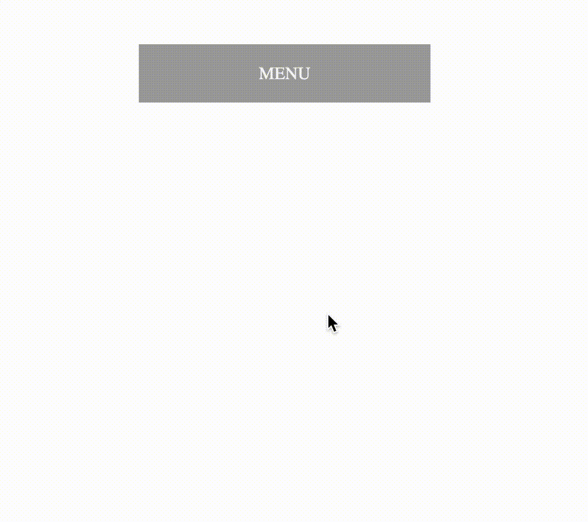

# Раскрывающееся меню

Мы настроили раскрывающееся меню в этом упражнении. Загрузите страницу, вы увидите один заголовок меню с выпадающим меню, которое откроется при клике по заголовку.

Ваша задача - добавить анимацию в выпадающее меню так, чтобы оно имело эффект расширения. Посмотрите на желаемый результат ниже и обратите внимание на _иллюзию отскока_ при раскрытии выпадающего меню близкого к его конечному состоянию.

### Подсказки
- Вам нужно указать свойство _transform-origin_, чтобы сделать начальную точку преобразования для выпадающего меню сверху.
- Вам нужно добавить промежуточный шаг к правилу keyframe, чтобы реализовать _иллюзию отскока_.

## Желаемый результат

### Проверка
- Выпадающее меню раскрывается после нажатия на заголовок меню.
- Есть _иллюзия отскока_ ближе к концу анимации.